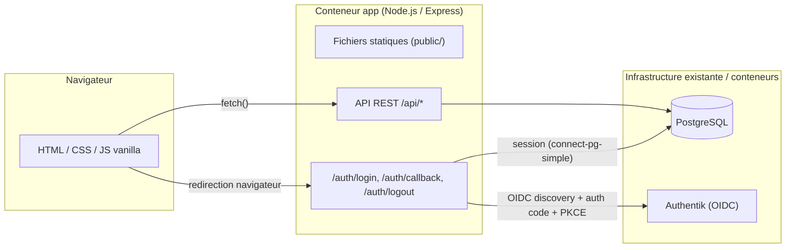
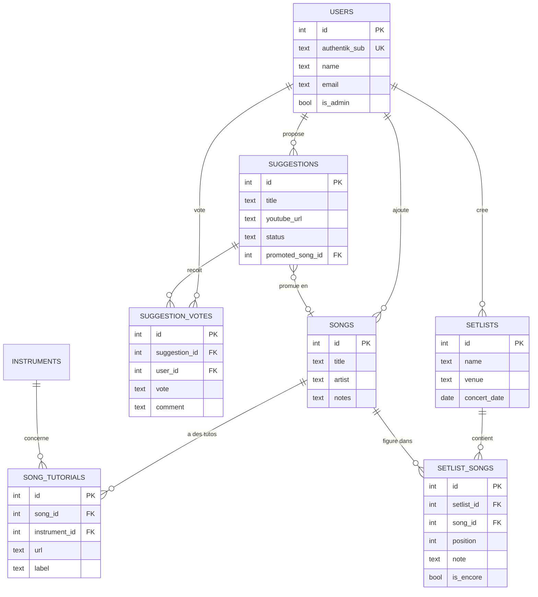
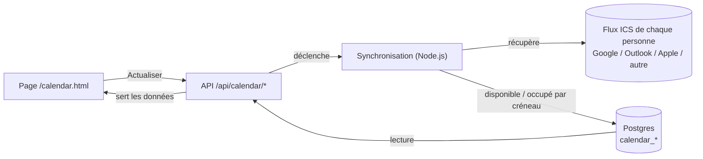

# Octane — outil de gestion du groupe

Application interne pour le groupe : répertoire de morceaux travaillés (avec liens de tutos par instrument), suggestions de nouveaux morceaux avec vote nominatif, setlist du prochain concert (avec rappel) et historique des concerts passés.

Stack 100% JavaScript : backend Node.js/Express servant des pages HTML/CSS/JS vanilla (pas de framework front, pas de build step) + API REST, PostgreSQL, authentification via OpenID Connect contre une instance Authentik existante.

## Démarrage rapide (serveur avec Traefik)

Ce qui suit correspond au déploiement réel : Traefik en reverse proxy, Authentik sur le même réseau Docker externe `traefik-proxy`, l'app exposée sur `octane.dandrove.com`, l'image tirée de `ghcr.io`.

```bash
git clone https://github.com/nfonteyne/octane-website.git
cd octane-website
cp .env.example .env
```

Éditer `.env` (au minimum) :

```
POSTGRES_PASSWORD=changeme
SESSION_SECRET=une-longue-chaine-aleatoire

AUTHENTIK_ISSUER_URL=http://authentik-server:9000/application/o/octane-website/
OIDC_CLIENT_ID=...
OIDC_CLIENT_SECRET=...
OIDC_REDIRECT_URI=https://octane.dandrove.com/auth/callback
ADMIN_GROUP_NAME=octane-admins

TRAEFIK_NETWORK_NAME=traefik-proxy
APP_DOMAIN=octane.dandrove.com
```

`POSTGRES_PASSWORD` est la seule variable Postgres à renseigner : l'app se connecte avec des champs séparés (host/port/base/utilisateur déjà pré-remplis avec les valeurs par défaut du service `postgres`), pas une URL unique — donc n'importe quel caractère spécial dans le mot de passe (généré par `openssl rand -base64` par exemple) fonctionne sans encodage particulier.

`AUTHENTIK_ISSUER_URL` utilise ici le nom du conteneur Authentik sur le réseau `traefik-proxy` (à remplacer par le vrai nom de service de la stack Authentik concernée — visible via `docker ps` sur cette stack) plutôt que l'URL publique, pour éviter un aller-retour inutile par Traefik. L'URL publique fonctionne aussi.

Pour générer `POSTGRES_PASSWORD` et `SESSION_SECRET` (valeurs aléatoires, à ne jamais commiter) :

```bash
openssl rand -base64 24   # POSTGRES_PASSWORD
openssl rand -hex 32      # SESSION_SECRET
```

Si `openssl` n'est pas disponible, une alternative sans dépendance :

```bash
node -e "console.log(require('crypto').randomBytes(24).toString('base64'))"   # POSTGRES_PASSWORD
node -e "console.log(require('crypto').randomBytes(32).toString('hex'))"      # SESSION_SECRET
```

Chaque valeur générée remplace `changeme` / `une-longue-chaine-aleatoire` dans `.env`.

Si le réseau `traefik-proxy` n'existe pas encore (il devrait déjà exister si Authentik tourne dessus) :

```bash
docker network create traefik-proxy
```

Puis démarrer :

```bash
docker compose pull
docker compose up -d
```

`docker-compose.yml` (à la racine du repo) est déjà prêt pour ce cas précis :

```yaml
services:
  app:
    image: ${APP_IMAGE:-ghcr.io/nfonteyne/octane-website:latest}
    container_name: octane-app
    restart: unless-stopped
    env_file: .env
    depends_on:
      - postgres
    networks:
      - default
      - traefik-proxy
    labels:
      - "traefik.enable=true"
      - "traefik.docker.network=traefik-proxy"
      - "traefik.http.routers.octane.rule=Host(`${APP_DOMAIN:-octane.dandrove.com}`)"
      - "traefik.http.routers.octane.entrypoints=websecure"
      - "traefik.http.routers.octane.tls.certresolver=myresolver"
      - "traefik.http.services.octane.loadbalancer.server.port=3000"

  postgres:
    image: postgres:16-alpine
    restart: unless-stopped
    environment:
      POSTGRES_DB: octane
      POSTGRES_USER: octane
      POSTGRES_PASSWORD: ${POSTGRES_PASSWORD}
    volumes:
      - pgdata:/var/lib/postgresql/data
    networks:
      - default

networks:
  default:
  traefik-proxy:
    external: true
    name: ${TRAEFIK_NETWORK_NAME:-traefik-proxy}

volumes:
  pgdata:
```

Pas de port publié sur l'hôte : Traefik parle directement au conteneur `octane-app` sur le réseau `traefik-proxy`, port 3000 (celui écouté par Express en interne).

## Intégration Traefik

Le `docker-compose.yml` ci-dessus utilise déjà les **labels Docker** (option recommandée). Deux cas selon la configuration de Traefik utilisée :

### Option A — provider Docker (labels), déjà en place

Si Traefik tourne avec le provider Docker activé (`--providers.docker=true` et accès au socket Docker) et surveille le réseau `traefik-proxy`, rien à faire de plus : les labels du service `app` suffisent. Vérifier que :
- Traefik est bien attaché au réseau `traefik-proxy`,
- l'entrypoint `websecure` et le `certResolver` `myresolver` correspondent aux noms utilisés dans la configuration Traefik en place (adapter les labels sinon).

### Option B — provider fichier (dynamic config)

Si Traefik est plutôt piloté par des fichiers de configuration dynamique, retirer les `labels` du service `app` dans `docker-compose.yml` et ajouter ce fichier au dossier de conf dynamique Traefik (ex: `dynamic/octane.yml`) :

```yaml
http:
  routers:
    octane:
      entryPoints: ["websecure"]
      rule: Host(`octane.dandrove.com`)
      service: octane-service
      tls:
        certResolver: myresolver

  services:
    octane-service:
      loadBalancer:
        servers:
          - url: "http://octane-app:3000"
```

`octane-app` est le `container_name` fixé dans `docker-compose.yml` — Docker en fait un nom résolvable en DNS pour tout conteneur attaché au même réseau (`traefik-proxy`), donc Traefik peut l'atteindre directement par ce nom sans passer par le provider Docker.

## Architecture



## Modèle de données



## Fonctionnalités

| Page | Accès | Description |
|---|---|---|
| `/index.html` | Tous (lecture et écriture) | Répertoire des morceaux travaillés, avec recherche instantanée (titre/artiste), liens/vignettes YouTube et Spotify, tutos embarqués par morceau et par instrument. Ajout avec autocomplete titre/artiste + liens auto-trouvés ([détails](#recherche-automatique-de-morceaux)) |
| `/suggestions.html` | Tous | Proposer un morceau (liens YouTube et Spotify + note libre), voter approuver/rejeter avec commentaire (attribué nominativement), ajouter une suggestion au répertoire |
| `/concerts.html` | Tous (lecture et écriture) | Deux onglets sur une même page. **Prochain concert** : choix des morceaux du répertoire, ordre, notes, section rappel, lien "Écouter la setlist sur YouTube". **Historique** : concerts passés, modifiables (date, morceaux, ordre, rappel) et supprimables, avec le même lien playlist ; deux vues, chronologique (par défaut, tous les concerts détaillés avec YouTube embarqué par morceau, du plus récent au plus ancien) et réduite (liste compacte) ; ouvrir un concert passé (`?tab=history&id=...`) reste partageable en lien direct |
| `/profile.html` | Chacun voit le sien | Profil issu d'Authentik (nom, avatar, groupes) + activité personnelle (morceaux ajoutés, suggestions, votes) |
| `/calendar.html` | Tous (lecture et écriture) | Disponibilités du groupe pour les 3 prochaines semaines (calendrier, filtres par personne, modale par jour) — [détails](#disponibilités-calendrier) |

Le mode par défaut est la consultation ; les pages Répertoire, Concerts et Suggestions sont interactives pour toute personne connectée (chaque action reste attribuée nominativement via Authentik).

Un bouton clair/sombre dans la barre de navigation permet de forcer un thème (mémorisé par navigateur) ; sans préférence explicite, l'app suit le thème du système.

## Rôles

- **Membre** : tout le monde — consulte, ajoute/modifie/supprime des morceaux du répertoire et leurs tutos, crée/modifie/supprime des concerts (à venir ou passés) et leur setlist, propose des suggestions, vote/commente, ajoute une suggestion au répertoire.
- **Admin** : en plus, rejette ou supprime une suggestion (modération).

Le rôle admin n'est volontairement pas plus étendu pour l'instant : son périmètre exact (au-delà de la modération des suggestions) reste ouvert et pourra évoluer. Il n'y a pas de gestion des utilisateurs dans l'application elle-même — Authentik reste la seule source de vérité pour qui a accès et qui est admin (claim `groups`, recalculé à chaque connexion).

## Recherche automatique de morceaux

En tapant un titre dans le formulaire "Ajouter un morceau" du répertoire, une liste de suggestions apparaît (titre, artiste, pochette), basée sur l'[iTunes Search API](https://developer.apple.com/library/archive/documentation/AudioVideo/Conceptual/iTuneSearchAPI/) d'Apple — **gratuite, sans clé, sans inscription**, donc ça fonctionne dès le premier déploiement sans rien configurer.

En sélectionnant une suggestion, l'app tente aussi de retrouver automatiquement les liens **YouTube** et **Spotify** correspondants. Ça, en revanche, nécessite des identifiants (facultatifs) :

| Variable | Obtenir | Sans elle |
|---|---|---|
| `YOUTUBE_API_KEY` | [Google Cloud Console](https://console.cloud.google.com/) → activer "YouTube Data API v3" → créer une clé API (quota gratuit largement suffisant pour un groupe) | Le champ lien YouTube reste vide, saisie manuelle |
| `SPOTIFY_CLIENT_ID` / `SPOTIFY_CLIENT_SECRET` | [Spotify for Developers](https://developer.spotify.com/dashboard) → créer une app → Client ID/Secret (flux "Client Credentials", pas de compte utilisateur impliqué) | Le champ lien Spotify reste vide, saisie manuelle |

Si aucune des deux n'est configurée, l'autocomplete titre/artiste marche quand même — seuls les liens ne se remplissent pas tout seuls. Ces clés peuvent être ajoutées à tout moment dans `.env` sans changement de code, juste un redémarrage du conteneur `app`.

Si la recherche ne trouve rien (morceau trop obscur, faute de frappe...), rien ne bloque : titre, artiste et liens restent modifiables à la main comme avant.

## Setlist en playlist YouTube

Sur la page d'un concert (prochain concert ou historique), un lien **"Écouter la setlist sur YouTube"** ouvre tous les morceaux ayant un lien YouTube à la suite, dans l'ordre du programme puis du rappel — via le lecteur "mix" temporaire de YouTube (`watch_videos?video_ids=...`), sans authentification ni appel API. Le lien n'apparaît que si au moins un morceau de la setlist a un lien YouTube renseigné.

Une vraie **playlist Spotify** (persistante, sur un compte Spotify) nécessiterait une autorisation OAuth d'un compte Spotify précis — le Client ID/Secret déjà utilisé pour la recherche automatique ([détails](#recherche-automatique-de-morceaux)) ne permet que la recherche, pas la création de playlists. Pas encore implémenté.

## Disponibilités (calendrier)

La page `/calendar.html` montre, pour les 3 prochaines semaines, les créneaux de répétition où chaque membre est disponible (par défaut lun–ven 18h30–21h, sam–dim 15h–19h — modifiable par un admin depuis `/admin.html`, section "Créneaux de répétition"). Cette section permet aussi de définir une **marge de transport** (en minutes) : la vérification de disponibilité regarde alors un peu avant et un peu après le créneau affiché, pour tenir compte du temps de trajet entre deux évènements du calendrier d'une personne — le créneau lui-même, tel qu'affiché, ne change pas. La disponibilité est déduite directement par l'application, sans service externe : chaque personne peut enregistrer un ou plusieurs calendriers (Google, Outlook, Apple, ou tout autre service exposant un flux ICS/iCal), gérés depuis la même page ("Calendriers des membres").

### Fonctionnement



- Bouton **"Actualiser les disponibilités"** : appelle `POST /api/calendar/refresh`, qui récupère chaque flux ICS enregistré et calcule la disponibilité en tâche de fond, pendant que la page sonde `GET /api/calendar/workflow-status` toutes les 4 secondes.
- Une personne peut avoir plusieurs flux (par exemple un calendrier personnel Google et un calendrier professionnel Outlook) : elle est considérée occupée sur un créneau dès qu'un seul de ses flux montre un évènement chevauchant ce créneau.
- Si le flux d'une personne est temporairement inaccessible, cette personne est simplement omise du résultat de cette synchronisation (les données précédentes ne sont pas écrasées par une supposition) — un avertissement est journalisé côté serveur (identifiant de la personne uniquement, jamais l'URL du flux ni le contenu d'un évènement).

### Confidentialité

Tous les fournisseurs de calendrier n'offrent pas la même granularité de partage :

- **Outlook / Office 365** propose un lien de partage "Disponibilité uniquement" — le flux ICS obtenu ne contient alors que des blocs occupé/libre, sans titre ni description.
- **Google Calendar** ("adresse secrète au format iCal") et **Apple iCloud** (calendrier partagé) reflètent en revanche le calendrier complet (titres, descriptions, invités, lieu), simplement protégé par une URL difficile à deviner.

La garantie de confidentialité ne repose donc pas sur le fournisseur, mais sur le traitement effectué par l'application elle-même : chaque flux est récupéré, réduit immédiatement à un statut occupé/libre par évènement (début, fin, journée entière), puis tout le reste (titre, description, participants, lieu) est abandonné avant que quoi que ce soit ne soit journalisé, stocké ou renvoyé par l'API. Seul un booléen disponible/occupé par créneau et par personne est conservé en base — jamais le contenu des calendriers.

### Personnes suivies

Les personnes affichées sur le calendrier ne sont pas une liste séparée à maintenir : ce sont directement les utilisateurs de l'application (comptes Authentik) ayant au moins un calendrier enregistré. Depuis `/admin.html`, section "Calendriers des membres", un admin voit tous les utilisateurs et peut attacher un ou plusieurs flux ICS à n'importe lequel d'entre eux — dès qu'un utilisateur a au moins un flux, il apparaît automatiquement sur `/calendar.html` (avec une couleur assignée automatiquement, sans configuration). Un utilisateur sans flux configuré n'apparaît pas.

## Prérequis

- Docker + Docker Compose
- Une instance Authentik déjà en place
- Un reverse proxy Traefik déjà en place, avec un réseau Docker externe partagé (`traefik-proxy` dans nos exemples) sur lequel Authentik est également connecté

## Configuration Authentik

1. Créer un **Provider** OAuth2/OIDC dans Authentik, avec comme redirect URI la valeur à utiliser dans `OIDC_REDIRECT_URI` (ex: `https://octane.dandrove.com/auth/callback`).
2. Créer une **Application** Authentik pointant vers ce provider.
3. S'assurer qu'un **scope mapping** expose un claim `groups` dans l'ID token (Authentik a un mapping `groups` intégré dans les versions récentes, sinon créer un mapping personnalisé renvoyant `request.user.ak_groups.all()`).
4. Créer un **groupe** Authentik (ex: `octane-admins`) et y ajouter les membres qui doivent être admins de l'application.
5. Noter le Client ID / Client Secret du provider.
6. Optionnel — pour afficher l'avatar sur la page profil (`/profile.html`) : le scope `profile` doit renvoyer un claim `picture`. Si la version d'Authentik utilisée ne le fait pas nativement, ajouter un scope mapping personnalisé renvoyant l'URL de l'avatar (ex: `request.user.avatar`). Sans ce claim, un avatar généré à partir des initiales est affiché à la place — aucune configuration n'est requise pour ce cas.

## Variables d'environnement (référence complète)

Le [Démarrage rapide](#démarrage-rapide-serveur-avec-traefik) ci-dessus couvre le cas concret. Référence complète des variables de `.env` :

| Variable | Description |
|---|---|
| `POSTGRES_PASSWORD` | Mot de passe Postgres, utilisé à la fois par le service `postgres` et par l'app (connexion par champs séparés, pas d'URL — aucun caractère à encoder) |
| `PGHOST` / `PGPORT` / `PGDATABASE` / `PGUSER` | Optionnels, déjà cohérents par défaut avec le service `postgres` du compose (`postgres`/`5432`/`octane`/`octane`) |
| `SESSION_SECRET` | Chaîne aléatoire longue pour signer les cookies de session |
| `AUTHENTIK_ISSUER_URL` | URL d'issuer OIDC de l'application Authentik (interne, ex: `http://authentik-server:9000/application/o/octane-website/`, ou publique) |
| `OIDC_CLIENT_ID` / `OIDC_CLIENT_SECRET` | Identifiants du provider Authentik |
| `OIDC_REDIRECT_URI` | URL publique de callback, doit correspondre à celle configurée dans Authentik (ex: `https://octane.dandrove.com/auth/callback`) |
| `ADMIN_GROUP_NAME` | Nom du groupe Authentik dont les membres deviennent admins |
| `AUTHENTIK_PUBLIC_URL` | Optionnel — URL publique d'Authentik, pour afficher un lien "Mon compte" (nav + page profil) permettant à chacun de changer son mot de passe. Masqué si absent |
| `TRAEFIK_NETWORK_NAME` | Nom du réseau Docker externe partagé avec Traefik et Authentik (défaut `traefik-proxy`) |
| `APP_DOMAIN` | Nom de domaine public utilisé par Traefik pour router vers l'app (ex: `octane.dandrove.com`) |
| `APP_PORT` | Port hôte utilisé uniquement par `docker-compose.dev.yml` (test local sans Traefik) |
| `SPOTIFY_CLIENT_ID` / `SPOTIFY_CLIENT_SECRET` / `YOUTUBE_API_KEY` | Optionnels — voir [Recherche automatique de morceaux](#recherche-automatique-de-morceaux) |

Les migrations SQL (`src/db/migrations/*.sql`) sont exécutées automatiquement au démarrage du conteneur `app`, de façon idempotente (une table `schema_migrations` garde la trace des fichiers déjà appliqués).

## Tester en local sans Authentik (ex: dans WSL)

Pas besoin d'avoir Authentik pour essayer l'application en premier lieu. Un mode `DEV_BYPASS_AUTH` remplace la redirection OIDC par un simple formulaire "choisissez un nom" — **à n'utiliser qu'en local, jamais en production**.

```bash
cp .env.example .env
```

Dans `.env`, mettre :

```
DEV_BYPASS_AUTH=true
POSTGRES_PASSWORD=changeme
SESSION_SECRET=une-longue-chaine-aleatoire
```

(Les variables `AUTHENTIK_*` / `OIDC_*` peuvent rester vides tant que `DEV_BYPASS_AUTH=true`.)

Puis, avec Docker Compose (fichier séparé `docker-compose.dev.yml`, sans dépendance au réseau Authentik) :

```bash
docker compose -f docker-compose.dev.yml up --build
```

Ou sans Docker du tout, avec un Postgres local :

```bash
npm install
# démarrer un Postgres local, puis dans .env : PGHOST=localhost (au lieu du
# nom de service Docker "postgres" par défaut) + POSTGRES_PASSWORD assorti
npm run migrate
npm start
```

Ouvrir `http://localhost:3000` redirige vers `/auth/login`, qui affiche un formulaire pour choisir un nom (et cocher "Compte admin" si besoin) au lieu de passer par Authentik. Chaque nom saisi crée un utilisateur distinct et persistant en base — pratique pour tester le vote sur les suggestions avec plusieurs "personnes" (ouvrir un autre navigateur ou une fenêtre de navigation privée pour se connecter sous un second nom).

Avant un déploiement avec `docker-compose.yml` (celui avec le réseau Authentik), repasser `DEV_BYPASS_AUTH=false` et configurer les variables `AUTHENTIK_*`/`OIDC_*`.

## Structure du projet

```
octane-website/
├── Dockerfile, docker-compose.yml, docker-compose.dev.yml
├── test/               # tests unitaires (node --test)
├── src/
│   ├── server.js, app.js, config.js
│   ├── db/            # pool Postgres, migration runner, migrations SQL
│   ├── auth/          # OIDC (Authentik), session, middleware, routes /auth
│   ├── routes/        # routes API /api/*
│   ├── repositories/  # accès SQL par table
│   ├── services/      # orchestration avec effets de bord (ex: synchronisation calendrier)
│   └── lib/           # helpers purs (dates, validation YouTube/Spotify...) — couverts par les tests
└── public/
    ├── *.html          # une page par fonctionnalité
    ├── css/style.css
    └── js/             # fetch wrapper, rendu, logique par page
```
