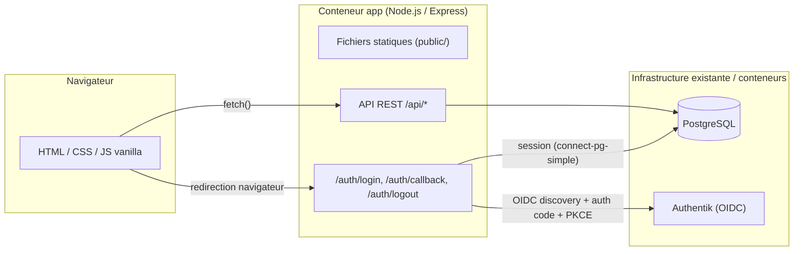
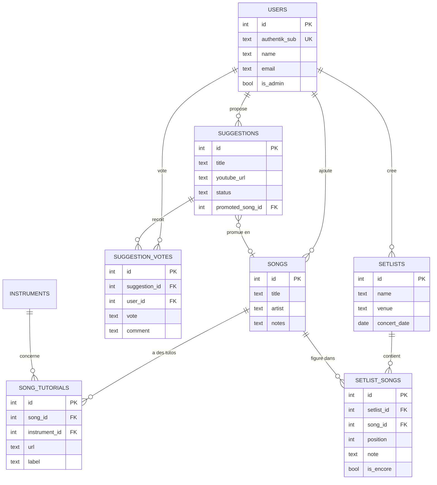

# Octane — outil de gestion du groupe

Application interne pour le groupe : répertoire de morceaux travaillés (avec liens de tutos par instrument), suggestions de nouveaux morceaux avec vote nominatif, setlist du prochain concert (avec rappel) et historique des concerts passés.

Stack 100% JavaScript : backend Node.js/Express servant des pages HTML/CSS/JS vanilla (pas de framework front, pas de build step) + API REST, PostgreSQL, authentification via OpenID Connect contre une instance Authentik existante.

## Architecture



## Modèle de données



## Fonctionnalités

| Page | Accès | Description |
|---|---|---|
| `/index.html` | Tous (lecture), admin (écriture) | Répertoire des morceaux travaillés, liens de tutos par morceau et par instrument |
| `/suggestions.html` | Tous | Proposer un morceau (avec lien YouTube embarqué), voter approuver/rejeter avec commentaire, attribué nominativement |
| `/setlist.html` | Tous (lecture), admin (écriture) | Setlist du prochain concert : ordre des morceaux, notes, section rappel |
| `/history.html`, `/history-detail.html` | Tous (lecture seule) | Historique des setlists des concerts passés |

Le mode par défaut est la consultation ; seule la page **Suggestions** est interactive (chaque vote est attribué à la personne connectée).

## Rôles

- **Membre** : consulte tout, propose des suggestions, vote/commente.
- **Admin** : en plus, gère le répertoire, les tutos, promeut une suggestion approuvée en morceau du répertoire, crée/édite les setlists.

Le rôle admin est déterminé par un claim `groups` renvoyé par Authentik (voir configuration ci-dessous), recalculé à chaque connexion — Authentik reste la seule source de vérité des rôles.

## Prérequis

- Docker + Docker Compose
- Une instance Authentik déjà en place, avec un réseau Docker accessible depuis ce projet

## Configuration Authentik

1. Créer un **Provider** OAuth2/OIDC dans Authentik, avec comme redirect URI la valeur que vous mettrez dans `OIDC_REDIRECT_URI` (ex: `https://octane.example.com/auth/callback`).
2. Créer une **Application** Authentik pointant vers ce provider.
3. S'assurer qu'un **scope mapping** expose un claim `groups` dans l'ID token (Authentik a un mapping `groups` intégré dans les versions récentes, sinon créer un mapping personnalisé renvoyant `request.user.ak_groups.all()`).
4. Créer un **groupe** Authentik (ex: `octane-admins`) et y ajouter les membres qui doivent être admins de l'application.
5. Noter le Client ID / Client Secret du provider.

## Installation

```bash
cp .env.example .env
```

Remplir `.env` :

| Variable | Description |
|---|---|
| `DATABASE_URL` | Chaîne de connexion Postgres (déjà cohérente avec le service `postgres` du compose) |
| `POSTGRES_PASSWORD` | Mot de passe du service Postgres |
| `SESSION_SECRET` | Chaîne aléatoire longue pour signer les cookies de session |
| `AUTHENTIK_ISSUER_URL` | URL d'issuer OIDC de l'application Authentik (ex: `https://auth.example.com/application/o/octane-website/`) |
| `OIDC_CLIENT_ID` / `OIDC_CLIENT_SECRET` | Identifiants du provider Authentik |
| `OIDC_REDIRECT_URI` | URL publique de callback, doit correspondre à celle configurée dans Authentik |
| `ADMIN_GROUP_NAME` | Nom du groupe Authentik dont les membres deviennent admins |
| `AUTHENTIK_NETWORK_NAME` | Nom du réseau Docker de votre stack Authentik existante (vérifier avec `docker network ls`) |
| `APP_PORT` | Port exposé sur l'hôte (défaut `3000`) |

Puis démarrer :

```bash
docker compose up --build
```

Les migrations SQL (`src/db/migrations/*.sql`) sont exécutées automatiquement au démarrage du conteneur `app`, de façon idempotente (une table `schema_migrations` garde la trace des fichiers déjà appliqués).

## Développement local (sans Docker)

```bash
npm install
# démarrer un Postgres local, renseigner DATABASE_URL dans .env
npm run migrate
npm start
```

## Structure du projet

```
octane-website/
├── Dockerfile, docker-compose.yml
├── src/
│   ├── server.js, app.js, config.js
│   ├── db/            # pool Postgres, migration runner, migrations SQL
│   ├── auth/          # OIDC (Authentik), session, middleware, routes /auth
│   ├── routes/        # routes API /api/*
│   └── repositories/  # accès SQL par table
└── public/
    ├── *.html          # une page par fonctionnalité
    ├── css/style.css
    └── js/             # fetch wrapper, rendu, logique par page
```
